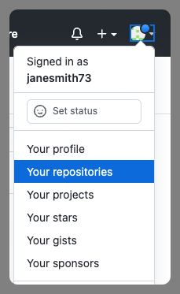
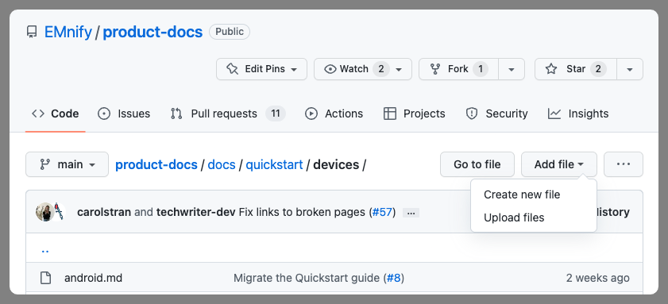
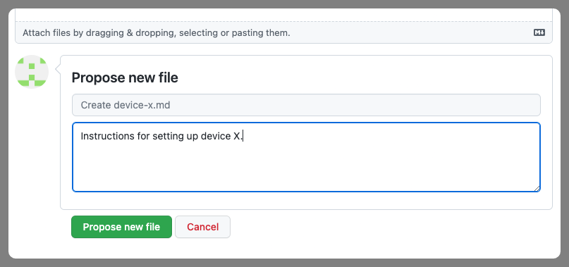

# Welcome to the emnify documentation contributing guide

Your interest in contributing to the emnify product documentation is greatly appreciated.
By helping maintain and grow our documentation, your efforts will not only benefit your organization but the greater emnify community as well.

---

- [The basics](#the-basics)
- [Updating the documentation](#updating-the-documentation)
  - [Navigate to the file you wish to edit](#navigate-to-the-file-you-wish-to-edit)
  - [GitHub will fork the repository for you](#github-will-fork-the-repository-for-you)
  - [Editing the page](#editing-the-page)
  - [Propose changes](#propose-changes)
  - [Comparing changes](#comparing-changes)
  - [Open a pull request](#open-a-pull-request)
  - [Pull request page](#pull-request-page)
- [Creating new content](#creating-new-content)
  - [Navigate to the containing directory](#navigate-to-the-containing-directory)
  - [Name your file](#name-your-file)
  - [Propose new file](#propose-new-file)
- [Previewing the documentation site](#previewing-the-documentation-site)
  - [Git](git)
  - [Clone the repository](#clone-the-repository)
  - [Node.js](#nodejs)
  - [yarn](#yarn)
  - [Preview the site](#preview-the-site)
---

## The basics

It is assumed that contributors, both internal and external, have some understanding of basic [Git](https://git-scm.com/) concepts.
[GitHub flow](https://docs.github.com/en/get-started/quickstart/github-flow) provides the essentials for collaborating on projects hosted in GitHub.

If you haven't worked with [Markdown](https://daringfireball.net/projects/markdown/) before, here are some resources to help you get started:

- [Basic syntax](https://www.markdownguide.org/basic-syntax/)
- [Extended syntax](https://www.markdownguide.org/extended-syntax/)
- [Markup reference for GitHub Docs](https://github.com/github/docs/blob/main/contributing/content-markup-reference.md) used in GitHub documents and comments
- [Docusaurus Markdown Features](https://docusaurus.io/docs/markdown-features) used in creating content for the emnify Documentation site

## Updating the documentation

If you don't already have a GitHub account, you will need to [sign up](https://github.com/signup) for one.
Once you have a GitHub account and have logged in, you will be able to contribute.

### Navigate to the file you wish to edit

Starting from the emnify Documentation [document root](https://github.com/EMnify/product-docs/tree/main/docs) directory, find the file you wish to edit.


### GitHub will fork the repository for you

If you haven't already forked the [emnify/product-docs](https://github.com/EMnify/product-docs) repository, GitHub will do it for you as soon as you select the edit icon.


Viewing your forked repository isn't necessary at this point in the process, but if you are curious, you can confirm that you now have a forked **product-docs** repository:




### Editing the page

Immediately after GitHub [forks the repository](#github-will-fork-the-repository-for-you), you are able to edit the file.
Now you can scroll down to find the text you wish to edit.

In this example below, we have edited the Glossary entry for _Dynamic IP_ to have more detail and to include a reference to the Glossary entry for _Static IP_.


### Propose changes

Once you are satisfied with the changes you have made, scroll to the bottom of the file.
There you will find an input field where you can provide a description or summary of your changes.
Then you can select **Propose changes** if you would like submit your changes.


### Comparing changes

After proposing your changes, the next step is to formally create a pull request (PR).
First, you will be presented a **Comparing changes** page that shows you the file(s) you have changed, your forked repository, and the name of your branch containing the changes.
In this example, GitHub automatically created the branch name **patch-1** for us.
Select **Create pull request** to continue.


### Open a pull request

Once you select **Create pull request**, you will be presented with the **Open a pull request** page.
Here you will have the opportunity to edit the name of the PR to something more descriptive.
In this example, we see it defaulted to the name of the file that was changed.

The input field below enables you to update the summary/description you previously provided.

Normally we will not edit your changes during our review.
However, you can enforce this by unchecking the **Allow edits by maintainers**.
If you want us to edit your changes as needed during our review, then please state this explicitly in the PR description and leave this option checked.

Once you select **Create pull request**, we will see your PR in our queue of [open PRs](https://github.com/EMnify/product-docs/pulls). 


### Pull request page

Immediately after creating the PR, GitHub takes you to the pull request details page.
You may want to book mark this page since it is where you can read comments from reviewers and provide any additional information we might request.

Please note the tabs on this page:

- **Conversation**: Where all feedback, review comments, and general communication takes place
- **Commits**: Each time you update your changes, they can be viewed here.
- **Checks**: If there are any syntax errors that would break the documentation build, they can be see here.
- **Files changed**: Very useful for PRs that involve changes needed in multiple files


## Creating new content

The process for creating new content is almost the same as [updating the documentation](#updating-the-documentation).

For adding a new page to the documentation, find the appropriate containing directory and choose **Add file**.
In the following example, we want to add a new device to the Quickstart guide.

### Navigate to the containing directory

From the [document root](https://github.com/EMnify/product-docs/tree/main/docs), search for a directory that matches the category of the content you wish to create.

Once you have found the best fit, navigate to that directory and select **Add file**.
In this example, we want to add a new device under `quickstart/devices/`.

If you expand the list of options for the **Add file** button, you can see that it is also possible to upload multiple files.



### Name your file

If you did not choose the **Upload files** option, you will be prompted to provide a name for your new file.


In this example, we supplied `device-x.md` for the name of the new file and created some content using the **<> Edit new file** interface.

### Propose new file

When your new contribution is ready, scroll to the bottom to provide a description and select **Propose new file**.



From the **Comparing changes** page, you will select **Create pull request** and follow the same steps in the "Updating the documentation" section starting with [Open a pull request](#open-a-pull-request).


## Previewing the documentation site

For larger contributions, especially when adding new pages, it becomes necessary to preview how the new content will look when rendered as HTML, and how it will fit it in with the existing documentation.

Since the documentation site is built using [Docusaurus](https://docusaurus.io/) which requires Node.js as well as a clone of this repository, there are a few steps needed to set up your environment.

### Git

If you do not already have Git installed please follow the installation steps specific to your platform.

- **Windows**: Follow these [instructions](https://www.atlassian.com/git/tutorials/install-git#windows).
- **macOS**:
    - Via [homebrew](https://brew.sh/index) if you already have it installed, or
    - Via [Xcode](https://apps.apple.com/de/app/xcode/) from the App Store.
- **Linux**: Preinstalled

### Clone the repository

[Clone](https://help.github.com/en/github/creating-cloning-and-archiving-repositories/cloning-a-repository) this repository
- Open your terminal (or PowerShell).
- Navigate to the location where you want the repository to reside.
- Issue the following command
```
git clone git@github.com:EMnify/product-docs.git
```

### Node.js

Install [Node.js](https://nodejs.org/en/about/).

### yarn

Follow yarn's [installation instructions](https://classic.yarnpkg.com/en/docs/install) for your platform.

After yarn is installed, you can install Docusaurs by navigating to your cloned repository in your terminal window (or PowerShell) and running yarn:

```
yarn
```

### Preview the site

Run the following and follow the instructions for opening the site in your web browser.

```
yarn start
```