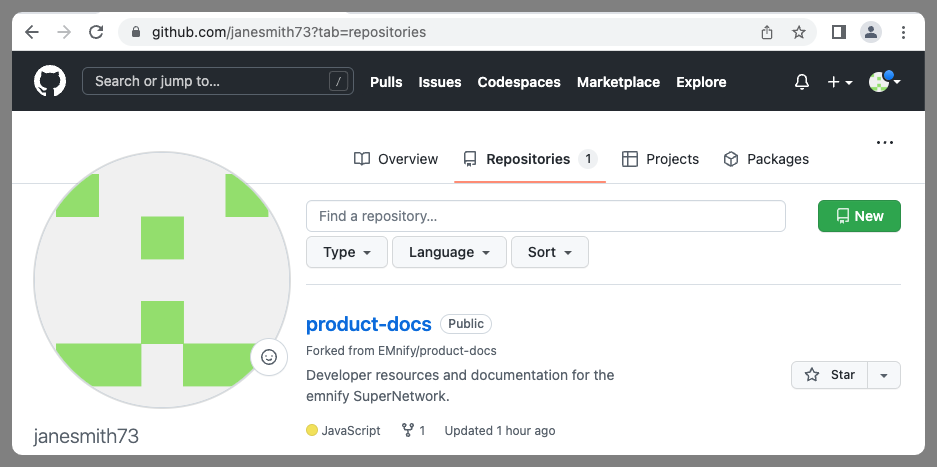
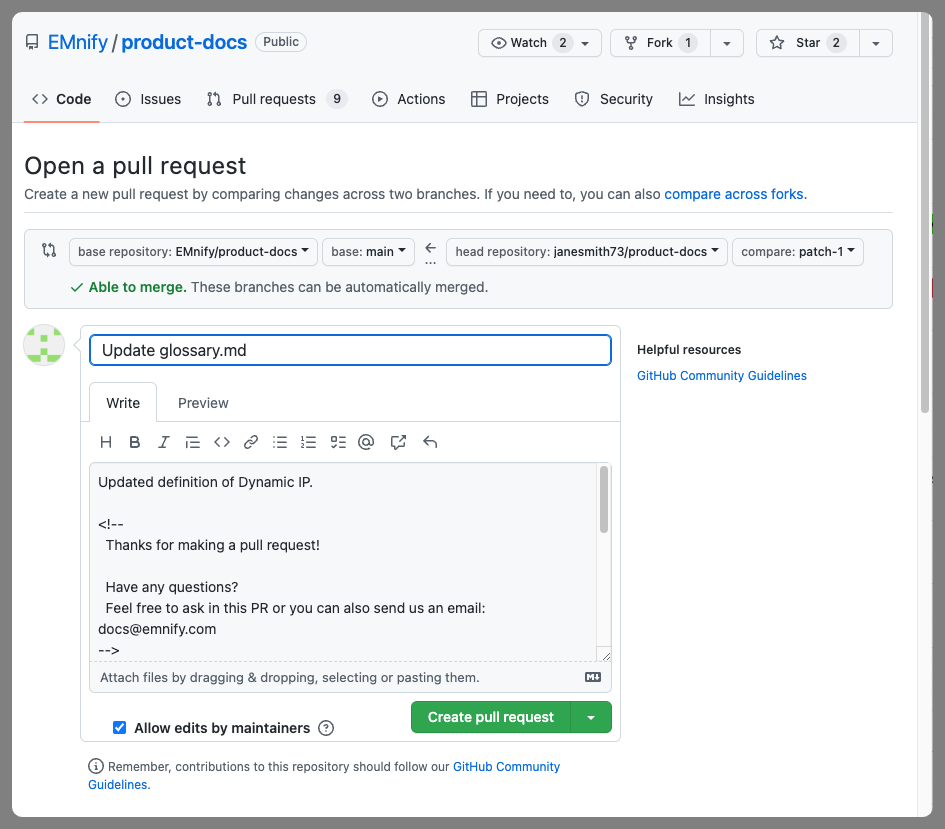
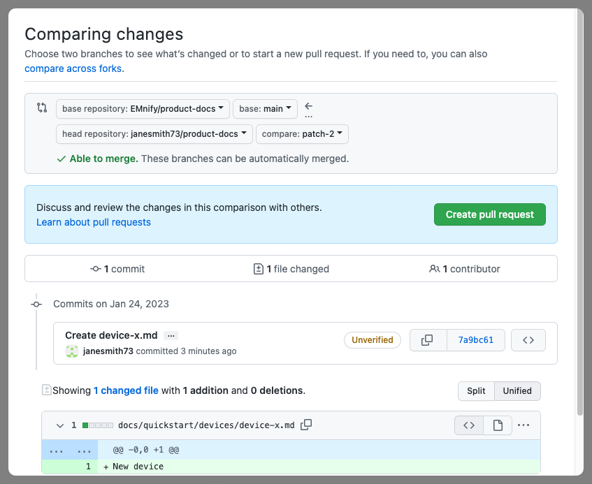

# Welcome to emnify Documentations contributing guide

We are glad that you are interested in contributing to the emnify Documentation.
Your effort in helping maintain and grow our documentation for the benefit of your own organization as well as for the greater emnify community is appreciated.

It is assumed that contributors, both internal and external, have some understanding of basic [Git](https://git-scm.com/) concepts.
[GitHub flow](https://docs.github.com/en/get-started/quickstart/github-flow) provides the essentials for collaborating on projects hosted in GitHub.

If you never worked with [Markdown](https://daringfireball.net/projects/markdown/), here are some resources to help you get started:

- [Basic syntax](https://www.markdownguide.org/basic-syntax/)
- [Extended syntax](https://www.markdownguide.org/extended-syntax/)
- [Markup reference for GitHub Docs](https://github.com/github/docs/blob/main/contributing/content-markup-reference.md) used in GitHub documents and comments
- [Docusaurus Markdown Features](https://docusaurus.io/docs/markdown-features) used in creating content for the emnify Documentation site

## Updating the documentation

If you don't already have a GitHub account, you will need to [sign up](https://github.com/signup) for one.
Once you have a GitHub account and have logged in, you will be able to contribute.

Starting from the emnify Documentation [document root](https://github.com/EMnify/product-docs/tree/main/docs) directory, find the file you wish to edit.


If you haven't already forked the [emnify/product-docs](https://github.com/EMnify/product-docs) repository, GitHub will do it for you as soon as you select the edit icon.


Once the page updates with the message that your GitHub has **create a fork of this project** (see above) you can scroll down to find the text you wish to edit.




### Creating a pull request





## Creating new content

For adding a new page to the documentation find the appropriate place and choose **Add file**.
In the following example, we want to add a new device to the Quickstart guide.


Selecting **Create new file** opens the editor and prompts you to give your new file a name:


When your new contribution is ready, scroll to the bottom to provide a description and choose **Propose new file**.


You will then be able to create the pull request.
The remaining steps are the same as above for [creating a pull request](#creating-a-pull-request) with editing exiting content.



## Previewing the documentation site

For larger contributions, especially when adding new pages, it becomes necessary to preview how the new content will look when rendered as HTML, and how it will fit it in with the existing documentation.

Since the documentation site is built using [Docusaurus](https://docusaurus.io/) which requires Node.js as well as a clone of this repository, there are a few steps needed to set up your environment.

### Git

If you do not already have Git installed please follow the installation steps specific to your platform.

- **Windows**: Follow these [instructions](https://www.atlassian.com/git/tutorials/install-git#windows).
- **macOS**:
    - Via [homebrew](https://brew.sh/index) if you already have it installed, or
    - Via [Xcode](https://apps.apple.com/de/app/xcode/) from the App Store.
- **Linux**: Preinstalled

### Clone the repository

[Clone](https://help.github.com/en/github/creating-cloning-and-archiving-repositories/cloning-a-repository) this repository
- Open your terminal (or PowerShell).
- Navigate to the location where you want the repository to reside.
- Issue the following command
```
git clone git@github.com:EMnify/product-docs.git
```

### Node.js

Install [Node.js](https://nodejs.org/en/about/).

### yarn

Follow yarn's [installation instructions](https://classic.yarnpkg.com/en/docs/install) for your platform.

After yarn is installed, you can install Docusaurs by navigating to your cloned repository in your terminal window (or PowerShell)and running yarn:

```
yarn
```

### Preview the site

Run the following and follow the instructions for opening the site in your web browser.

```
yarn start
```