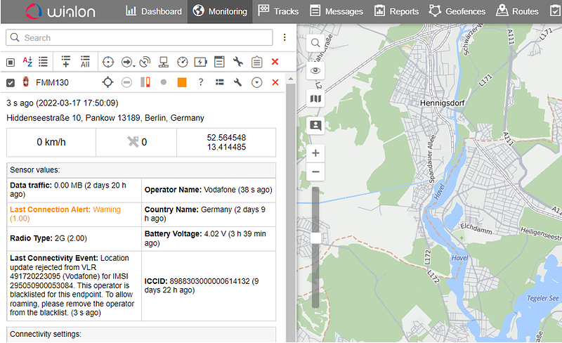

# Data Streamer integration to Gurtam flespi and Wialon

## Troubleshoot connectivity together with telematics data in flespi and Wialon

When managing a fleet of devices, nothing is more important than having remote access to device data. There can be many reasons why a device is not able to send data and troubleshooting a device can slow down operational teams trying to find a root cause - often with information hints in different applications for device management, telematics, server logs, and connectivity.

Gurtams' flespi and Wialon platforms for telematics providers not only correlate and parse data from various GPS devices and other data sources - but also offer an easy-to-use telematics application that grants full control over the vehicle fleet.

In this integration guide, I will show how to correlate connectivity metadata from the [EMnify Datastreamer](https://www.emnify.com/data-streamer) with GPS device data in flespi and Wialon, so that fleet managers can directly see connectivity and telematics side by side in Wialon - enabling faster troubleshooting. 

### Prerequisites

For this guide, you should have a base familiarity with flespi and the EMnify portal. You will only need:

-   A GPS tracking device with EMnify SIM (we will use a Teltonika FMM130 tracker)
-   A flespi account and a Wialon account 
-   An EMnify account   
      
    

The integration guide has the following five steps:

1.  [Set up flespi telematics hub with device and EMnify Data Stream channels](https://www.emnify.com/integration-guides/datastreamer-integration-wialon-flespi#channel)
2.  [Parse EMnify Data Stream data in flespi](https://www.emnify.com/integration-guides/datastreamer-integration-wialon-flespi#Parse)
3.  [Enable data merging via ICCID or IMEI](https://www.emnify.com/integration-guides/datastreamer-integration-wialon-flespi#correlation)
4.  [Set up stream outflow to Wialon](https://www.emnify.com/integration-guides/datastreamer-integration-wialon-flespi#outflow)
5.  [Build up sensors, message overview, and reports in Wialon](https://www.emnify.com/integration-guides/datastreamer-integration-wialon-flespi#wialon)  

## 1. Set up flespi telematics hub with device and Data Stream channels

First up, let's [log in to your flespi](https://flespi.io/#/) account and create two channels - one for your telematics devices and another one for the EMnify Datastreamer:

Simply go to Telematics Hub -> Channel and create a new channel by clicking the "+" at the bottom right corner. 

For this tutorial, I am using a Teltonika FMM130 device - therefore I select for the device channel the protocol_id "teltonika". 

The newly created channel has the server address and port that you will need to configure on your device. 

For Teltonika devices the configuration can be done via the software configurator over USB / Bluetooth or through SMS. You can, for example, send the SMS via the EMnify portal:  
"setparam 2001:em;2004:101997.flespi.gw;2005:20107;" which will configure the device to send to the channel.

Data from the device should appear in the channel -> Logs & Messages.

Now let's configure the channel for the EMnify Data Streamer. Create another channel by clicking the "+" at the bottom right corner of the Channels dialog. 

This time use as protocol_id "http". As the device identifier, you may use the EMnify platform endpoint ID: "%/endpoint/id%".   
The newly created channel has the server information regarding which IP address and port the Data Streamer should send the connectivity metadata to. 

Now log in to the EMnify portal and go to the Integrations tab. Click on "Add new Data Stream" and click on the "ADD" button under Webhook. 

Select to stream events, and as the destination use the URL information from the channel you created in flespi. The target URL is http://host:port - in our case http://gw.flespi.io:25262/.

After your devices create some connectivity data you should start seeing messages flowing into the Datastreamer channel in flespi. 

## 2. Parse EMnify Data Stream data in flespi

The EMnify Data Stream delivers connectivity data in JSON object form. Flespi can parse the data into parameters so they will be easily accessible as columns and later on also as sensor values in Wialon. 

The message parameter parsing needs to be set up in flespi within the Datastreamer channel. Click on the channel and on the "Edit" tab. Now go to the section message parameter and start defining values that you would like to retrieve from the Data Stream.

In the below table, there are the most relevant information and JSON paths that you need to configure. You are free to choose the parameter name - except that you need to use the same parameter name for the ICCID (gsm.sim.iccid). This guide will continue with the parameter names as defined in the below table.

Parameter Name

Parameter Value Path

Meaning

gsm.sim.iccid

/sim/iccid

The [ICCID](https://www.emnify.com/iot-glossary/iccid-number) will serve as a correlation parameter

emnify.imeisv

/detail/pdp_context/imeisv

IMEI-SV - alternative for correlation only PDP context messgae

emnify.description

/description

event meaning

emnify.severity.id

/event_severity/id

numerical value - 1:INFO 2: WARN 3:Critical

emnify.severity.description

/event_severity/description

text value of severity

emnify.rat

/detail/pdp_context/rat_type

radio access type  
1: 3G 2: 2G 5: HSPA+ 6:4G 8:NB-IoT

emnify.endpoint.name

/endpoint/name

device name as defined in EMnify portal

gsm.mcc

/detail/country/mcc

mobile country code

gsm.mnc

/detail/mnc/mnc

mobile network code

gsm.mnc

/detail/pdp_context/mnc

mobile network code in PDP context msg

gsm.imsi

/imsi/imsi

IMSI

emnify.operator.name

/detail/name

network name, e.g. Vodafone

emnify.country

/detail/country/name

country name

emnify.volume

/detail/volume/total

used volume in last PDP context

emnify.deviceIP

/endpoint/ip_address

private static  IP of device

Now you will be able to see the parsed parameters in columns under Logs & Messages. You can add the new parameters as columns by clicking on a message and then clicking on the add column icon for the parameter. 

## 3. Enable data merging

In order to correlate the device and Datastreamer data, there needs to be a common device identifier throughout all the messages. There are two device identifiers that can be used for the correlation: ICCID or IMEI. 

### 3.1 Recommended Option: Correlation with SIM ICCID 

The ICCID is the SIM card identifier. This identifier is present in all device-related messages of the EMnify Data Stream. Most GPS trackers also provide the ICCID. For the Teltonika FMM130 device, the commands to activate the sending of the ICCID is "setparam 50250:1;50251:3; 50254:0".  
  
Unfortunately, the ICCID format of the Teltonika device differs from the one in the Data Stream so we need to do some data manipulation. The Teltonika device sends an additional check digit at the end (20 digits instead of 19). So, in case this also applies to your device - here is how to manipulate the data:

1.  Create a plugin by going to the flespi **Telematics Hub** - **Plugin** section and clicking the "**+**" in the lower right corner. The plugin is supposed to strip the last digit from the ICCID of the Teltonika device. Give it a meaningful name and as **type_id** select **msg-pvm-code.** The code is**:** **`   .gsm.sim.iccid ==> input:`  
        `unparsed ==> $iccid_len       [size=$iccid_len - 1] ==> %text ==> #gsm.sim.iccid`**  
        **`   `**
2.  Create a device in the **Telematics Hub** -> **Device** section. Give the device a name and select the appropriate **Device typeID**, **IMEI,** and **MSISDN** / **phone number** (especially relevant if you also want to use the SMS integration).  
      
    

        Then go to the Plugins tab and assign the plugin that you previously created to the   
        device.  
       

### 3.2 Alternative Option: Correlation with device IMEI 

The IMEI is the identity for the modem of a device - and all GPS trackers provide the data. The Datastreamer does not include the IMEI in all messages, only in the PDP context create and delete events. Only these can be correlated with the device data when using the IMEI as a correlation parameter.   
Furthermore, the IMEI format differs from the one that the device reports. The device reports the 15 digit IMEI with the Luhn check digit - and the Datastreamer the 16 digit IMEI-SV, which is the IMEI without the check digit but with two extra digits for the software version. You will need two plugins similar to the plugins that we created for the ICCID correlation. 

1.  Create a plugin that removes the last digit of the GPS device IMEI and saves it into another field. Go to the flespi **Telematics Hub** - **Plugin** section and click the "**+**" in the lower right corner. Give the plugin a meaningful name and as **type_id** select **msg-pvm-code****.** The code is:  
    `.ident ==> input:`
    
             `unparsed ==> $ident_len`  
             `[size=$ident_len - 1] ==> %text ==> #device.imei`
    
2.  Create another plugin that removes the last two digits from the IMEI-SV that the Datastreamer provides. Make sure that the emnify.imeisv is correctly parsed as outlined in Step 2 of this guide. As **type_id** select **msg-pvm-code****.** The code is:  
    `.emnify.imeisv ==> input:`
    
             ``unparsed ==> $`imeisv`_len``  
             ``[size=$`imeisv`_len - 2] ==> %text ==> #device.imei``
    
3.  Create a device in the **Telematics Hub** -> **Device** section for every device that you are managing. Add the plugin that strips of 1 digit.
4.  Go to the Data Stream channel in **Telematics Hub -> Channel -** and add the plugin that strips two digits off the IMEI-SV.

You will now see in both the device and Datastreamer logs & messages with the same device.imei parameter. 

## 4. Set up stream outflow to Wialon

Now that both the device and Data Stream have the same correlation parameters - it is a matter of setting up the data flow to the Wialon telematics platform with the right correlation parameter. Within the Telematics Hub -> Streams section create a new Data outflow. The protocol_id is HTTP and the URI is where your Wialon instance is running. As the identifiers mask use either %gsm.sim.iccid% (if you are using the ICCID as correlation parameter - Step 3.1) or %device.imei% (if you are using the IMEI for correlation - option Step 3.2).  

  
Now it is time to set up Wialon. Login to your Wialon account - go to the Unit menu option and click on "new" to create a new device. As device type select "flespi gateway" - under the Server address use the same address as in flespi needs to be configured. As the "Unique ID" select the (stripped down) ICCID or IMEI dependent on which value you use for the correlation. 

Now you should be able to see device and connectivity data in the message dialogue with the message parameters that you have defined in flespi.   

## 5. Build up sensors, message overview, and reports in Wialon  

Now that the parameters are flowing into Wialon it is a matter to correctly set up the reporting on these parameters to make them accessible in the monitoring and report sections of Wialon.  
  
Setup sensors in Wialon

First, click on the wrench icon for the device you configured to set up new Sensors for the connectivity information. Most of the Sensors we will be needing are custom sensors as they include text parameters. 

Basically, you can set up for every parameter defined in section 2 a custom sensor - for example for the network operator - using the emnify_operator_name parameter (Wialon uses lower dashes instead of a point) and with a checkmark on the text parameter.   
Go ahead and define also text parameters for emnify_description, emnify_endpoint_name,  gsm_sim_icccid, ... as shown in the table below. Note that although ICCID is a number - you also need to use the text parameter checkmark. If you also show the time - you will be able to see when the last change of the parameter happened - so for example when the last time the network or country was changed. 

There are three numeric parameters where it makes sense to make a special configuration.

For the sensor configuration for emnify_severity_id use the interval and color scale at bottom of the view to define the meaning of the values.  
  
0 - indicates a normal connectivity event   
1- indicates a warning, which usually means that there is a temporary connectivity issue or the connection is blocked due to a policy  
2 - indicates alert - the connectivity cannot be established

The other configuration is for the radio access types. Use a custom sensor and define intervals and colors so you are able to translate the values into meaningful information. 

1 - 3G/UMTS  
2 - 2G / GSM  
6 - 4G / LTE-M   
8 - NB-IoT     
  
Adding connection alert icon to the monitoring panel

Wialon has some nice icons on the monitoring panel to quickly identify the state of the unit. You can add custom sensors to this panel - such as the connectivity alert. Just go to the Advanced setting under Unit properties dialogue and configure for the usage of sensor colors in the monitoring panel the connection alert sensor. 

Now you will not only be able to see the connectivity values in the monitoring dashboard but also in the shortcut icons, giving you a quick indication in case something goes wrong.   
  

Now that you have properly set up the sensors you can use them like any other device parameters in reports, tracks, or notifications.   
  
Setup notifications 

A very powerful Wialon feature is notifications. Notifications are triggered on different parameters values and can be used to send an email, telegram messages, generate pop-up notification, execute API calls, send commands, and much more.   
With having the connectivity information available you can also trigger notifications on for example a device having connectivity issues which also includes the time and location of the device.  
  
Go to Notifications and create a new one. Select the unit(s) the notification shall apply to and start configuring it. As trigger type choose sensor value. As Sensor Type use the Custom sensor and select the Last Connection Alert. The alert should only be triggered for values 1 and 2.  
  

  
  
Then you can configure which action shall be executed. As an example, we will create a pop-up notification indicating the sensor - and also which event description is applied. 

As a result, you will receive notification in case any of the units you have selected created a connectivity alert event. 

Summary  

Gurtams' flespi and Wialon platforms enable developers and solution providers to implement very customizable and powerful telematics solutions. Within this integration guide we have shown how to integrate cellular connectivity data that is available via the EMnify Datatreamer, helping operations teams to quickly triage and identify device and connectivity issues within the Wialon platform itself.