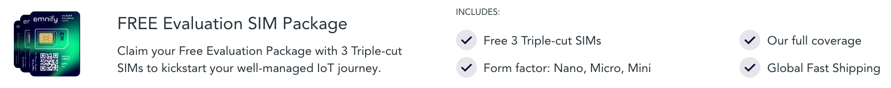

# Sign up for an emnify account

To begin developing your IoT solutions with emnify, you'll need an emnify account.
[Sign up](https://portal.emnify.com/sign/up) for free to a 60-day trial to use all functionalities.

## Order a free evaluation SIM package

You can order your free Evaluation SIM package on the emnify Portal with which you can test all emnify services.
Currently, the 3 physical SIM cards can be delivered to most destinations at no charge.
For other destinations, we do charge a small shipping fee.

To get started immediately, you can download the eSIM for your smartphone or eSIM enabled tablet for free.

Log into your [emnify account](https://portal.emnify.com) and follow these steps:

1. On the dashboard, click on order on **Get your free SIMs**
1. Select the SIM cards of your choice.
You can choose between 3-in-1 (no nano SIM) or 4-in-1 (with nano SIM).
1. Fill in your shipping details.
1. Proceed to pay the shipping charges and you will be notified when the SIM cards will be shipped.