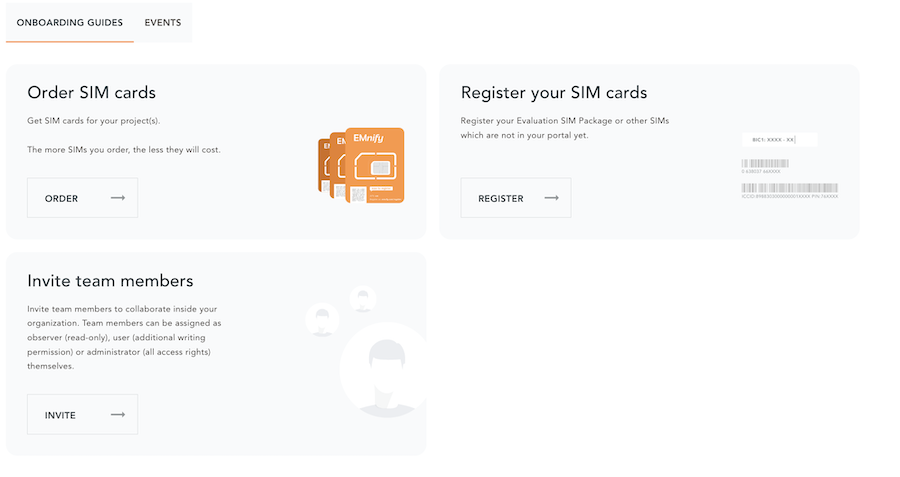
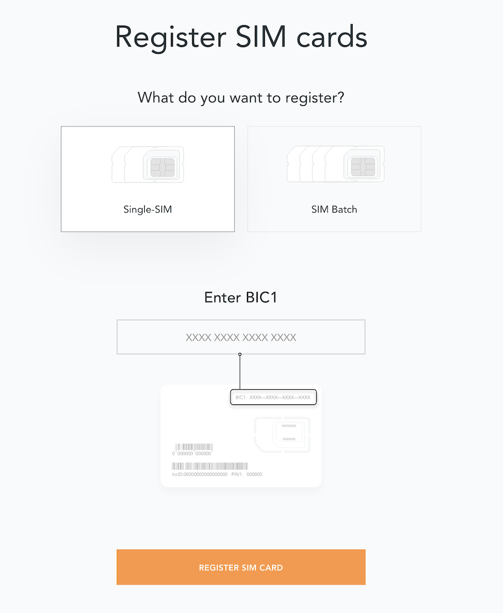
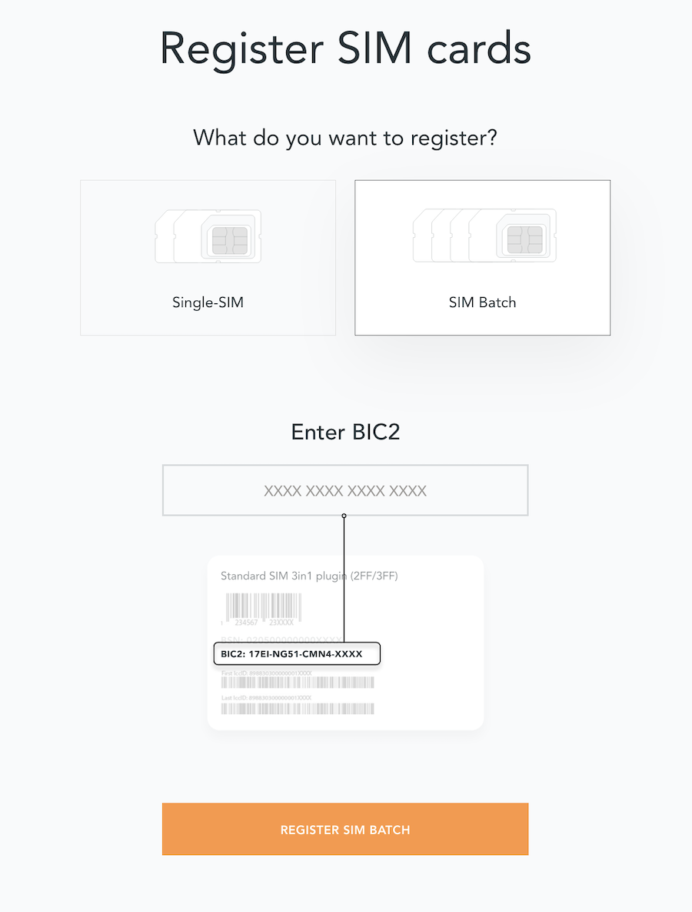
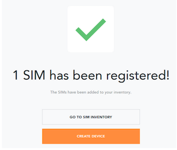

# Registering SIMs

Once you get your emnify SIMs, you need to register them before you can start using them.

1. If you have ordered the 3 orange evaluation SIM cards, you will have to register them one by one.
Scan the QR code printed on the SIM card with your QR code scanner app and follow the link to associate the SIM with your account.
The link includes the **BIC** (Batch Identification Code) of the card.

1. If you do not have a QR reader or want to do this on a desktop PC without a camera, register by manually entering the BIC.
Login to your [emnify account](https://portal.emnify.com?utm_source=dev-hub).
On the dashboard, click the [REGISTER](https://portal.emnify.com/sim-registration/single) link in the "Register your SIM cards" section.

1. Enter the Batch Identification Code (**BIC** 1) in the prompt. You can find the BIC1 on the back of your SIM card.

1. If you have ordered more than 5 SIM cards, you need to batch register them using the **BIC2**.

If you have a developer eSIM, the downloading process of an eSIM
automatically registers it in our portal.