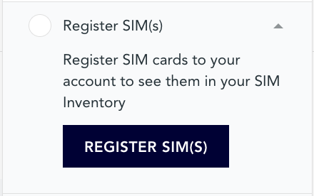
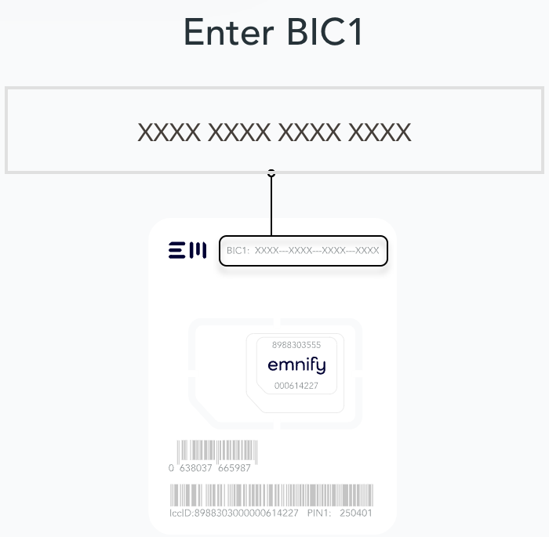
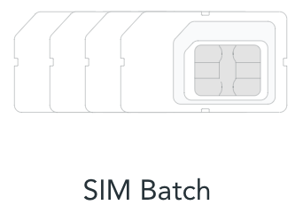
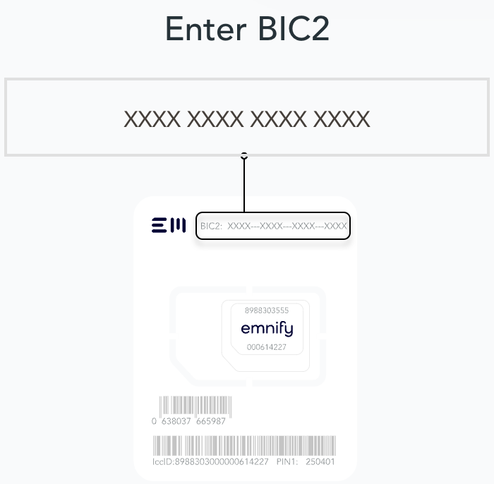

# Registering SIMs

Once you get your emnify SIMs, you need to register them before you can start using them.
If you order the free Evaluation SIM package, you will have to register each of the 3 SIMs separately.

1. Login to your [emnify account](https://portal.emnify.com).  
1. From the **GET STARTED** menu, select [Register SIM(s)](https://portal.emnify.com/sim-registration)  

1. Since the Single-SIM registration is already selected by default, enter the Batch Identification Code (**BIC1**) in the prompt:  

1. If you ordered more than 5 SIM cards, select **SIM Batch**.  

1. Enter the **BIC2** number for the SIM batch.  

