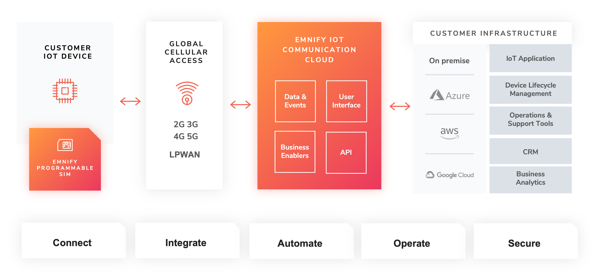

# Service Stack Overview

EMnify Service Stack

EMnify offers the following high-level products and services:

- A programmable [Global IoT SIM](services#global-iot-sim)
    - Including an [eSIM](services#esim) for quick evaluation
- A reliable [Global IoT Network](services#global-iot-network)
    - With [Mobile Network Aggregation](services#mobile-network-aggregation) 
    - Access to all [Radio Access Types](services#radio-access-types) including IoT optimized [LPWAN: LTE-M/NB-IoT](services#lpwan-lte-mnb-iot)
- The EMnify [IoT Cloud Communication Platform](services#iot-cloud-communication-platform) including
    - [User Interface](https://portal.emnify.com/sign/up) for operating and managing connectivity and SIMs
    - [Distributed Data Plane](services#distributed-data-plane)
    - with [Regional Breakout](services#regional-breakout) to ensure data does not traverse continents
- A holistic SASE oriented approach for a central control over [Security](services#security) and networks
    - [DNS](services#dns) 
    - [IMEI Lock](services#imei-lock)
- [Cloud Connect](services#cloud-connect) for connecting with other cloud platforms
    - [AWS Intra-Cloud Connect](services#aws-intra-cloud-connect)
    - [IPsec](services#ipsec)
- [OpenVPN](services#openvpn)
- [SMS](services#sms) communication
- [User Management](services#user-management)
- [Business Intelligence and Analytics Reports](services#-business-intelligence-and-analytics-reports)
- Business enablers such as [No-Code Workflow Automation](services#no-code-workflow-automation) to automate workflows between third party applications
- API and tools for [SIM Life Cycle Management](services#sim-life-cycle-management)
- [Endpoint Management & Group Policies](services#endpoint-management-group-policies)
- [Cloud Integrations](services#integration-guides) to the infrastructure where your application or 3rd party services lie.