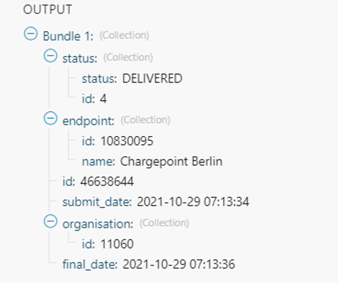

# Services

## Global IoT SIM

EMnify IoT SIMs are more durable than regular SIM cards and come in different [form factors](#form-factors) and [quality grades](#quality-grades).
For testing the platform services quickly without any SIM hardware - EMnify offers an [eSIM](#esim) which can be downloaded directly onto a supported smartphone.
EMnify also has a [multi-IMSI software application](#multi-imsi-application) directly on the SIM so different operator profiles can be used based on the location of the device.
Using this technology, EMnify can provide a superset of roaming networks from traditional operators.

#### Form Factors

The traditional, pluggable SIM card comes in 4 different form factors:

- 1FF (approximately the size of a credit card) - 85 x 54 x 0,76mm
- 2FF (mini SIM) - 25 x 15 x 0,76mm
- 3FF (Micro SIM) - 15 x 12 x 0,76 mm
- 4FF (Nano SIM) - 12,3 x 8,8 x 0,67 mm

EMnify offers pre-punched SIM cards in different combinations 2-in-1 (1FF and 2FF), 3-in-1 (1FF,2FF,3FF), and 4-in-1 (1FF,2FF,3FF,4FF).
Especially in use cases where the devices are moving, it is advisable to use a SIM that fits the device exactly and does not contain another smaller form factor punched out.
Not only are such SIMs are more durable, but their contact with the device is firmer.

Another form factor is MFF2 which is also referred to as an embedded SIM.
Its dimensions  6 x 5 x 0.75-0.82 mm.
These embedded SIMs are soldered onto a device and are not removable.

:::note
The term *eSIM* is used when referring to the MFF2 factor. Nevertheless, the term eSIM is also used when referring to SIMs whose operator profiles can be updated over the air.
These eUICC-based eSIMs can come in any of the described form factors, not just MFF2.
While eSIM/eUICC is widely adopted for consumer smartphone and watches, for IoT use cases (where the profile cannot be download via a screen or QR reader) the commercial and deployment model of the required infrastructure prohibits an easy change of operator profiles and is therefore not widely adopted.
:::

#### Quality Grades

The EMnify SIM cards come in two different quality grades **Commercial** and **Industrial**.
The following table shows comparisons to a standard consumer SIM.

| Parameter | Consumer SIM | Commercial | Industrial |
| --------- | ------------ | ---------- | ---------- |
| Available form factors | 2FF, 3FF, 4FF | 2FF, 3FF, 4FF |MFF2, 2FF, 3FF (2-in-1 or 3-in-1) |
| Temperature Range | - | 25° - 85°C | -40° - 105°C |
| Data Retention | 10 years | 10 years | 15 years at 85°C |
| Write Cycles | 100,000 | 500,000 | 1,000,000
| Memory | 64-128 kB  | 128 kB | 128 kB |
| Corrosion Resistance Jedec JSD22-A107 | - | CA | CC |
| Moisture Resistance Jedec JESD22-A102 |- | 110°C / 85% RH | 130°C / 85% RH |
| Humidity Resistance Jedec JESD22-A101 | - | - | HA |
| Vibration Jedec JESD22-B103 | - | - | VA |
| Mechnical Shock Jedec JESD22-B104 | - | - | SA |
| Low Power features | - | •&nbsp;Poll Interval negotiation •&nbsp;UICC&nbsp;suspension and resume | •&nbsp;Poll Interval negotiation •&nbsp;UICC&nbsp;suspension and resume |
    

#### eSIM

EMnify offers an easy entry to test the services and platform by downloading an EMnify eSIM profile to an eSIM compatible phone or tablet.
During the trial period every organization has the option to download one profile which can be used instantly.

The eSIM does not use a multi-IMSI applet (unlike the physical SIM cards) and therefore has some differences in the network coverage. 
For a list of supported devices and limitations please refer to the [knowledge base](https://support.emnify.com/hc/en-us/articles/360021545600-Evaluation-eSIM-device-support-and-restrictions#h_01F7V2BVKT0RQRVXK3VNSPYQMW).

The eSIM can be used to test and verify all EMnify functionalities including:

- Availability of networks
- API functionality
- Cloud Connect and Data Streamer integration
- Zapier No-Code Integrations

#### Multi-IMSI Application

EMnify IoT SIM cards are equipped with a multi-IMSI applet that contains EMnify’s as well as our partner operators' profiles. 
Different operator profiles are identified by their [IMSI](glossary#imsi---international-mobile-subscriber-identity).
Each IMSI / partner operator usually has more than one network accessible per country.

The SIM applet utilizes a preferred IMSI list per country.
When a device moves to a different country which has a different preferred IMSI configured, the applet dynamically overwrites the previously active IMSI with the preferred IMSI for this country. 
Similarly, when an operator’s service experiences an outage, the SIM can automatically fall back to another IMSI to ensure that the connection remains uninterrupted.

The selection of the preferred IMSI for each country is based on multiple factors including:

- If permanent roaming is permitted in that country
- IMSI that has the most network partners in the country
- IMSI that has the best availability of radio access types (LTE, NB-IoT, LTE-M) or features (PSM/eDRX)
    
The Multi-IMSI applet is transparent for the device and has no impact on the device operation. 
In order to analyze which IMSI is currently in use, you can either check in the **EMnify Portal** → **Connected devices** → **Details** or also query the device directly using the AT-command `AT+CIMI?`.

### Global IoT Network

Even when IoT devices are more often only deployed at a single location and are not moving, for a vendor selling to multiple countries it is important to have a global connectivity solution, so that there is no need to have different SIM cards in stock or have multiple contracts and tariffs.

#### Mobile Network Aggregation

EMnify uses an approach to aggregate the roaming footprint of multiple operators with the goal of offering access to every network in the world.
Mobile operators utilize roaming in foreign countries so their subscribers can stay connected when traveling.
Often operators do not have roaming agreements with all countries or only have a roaming agreement for one network – which is sufficient for roaming travelers but not ideal for devices that could be anywhere in the country.
EMnify works with multiple partner operators across the globe to be able to offer more networks at a commercially viable rate.
The EMnify [multi-IMSI applet](#multi-imsi-application) makes it completely transparent for the device to identify which roaming agreement of which operator is being utilized.

#### Radio Access Types

The EMnify IoT SIM and platform supports all devices and modules using the following radio access technologies

- [2G (GSM/GPRS/EDGE)](#2g-gsmgprsedge)
- [3G (UMTS/WCDMA/HPSA/HSDPA)](#3g-umtswcdmahpsahsdpa)
- [4G (LTE/LTE-A/LTE-CATXX)](#4g-ltelte-alte-catxx)
- [5G (New Radio)](#5g-new-radio)
- [LTE-M (CAT-M1)](#lpwan-lte-mnb-iot)
- [NB-IoT (CAT-NB1, CAT-NB2)](#lpwan-lte-mnb-iot)

When a device wants to connect with any of these radio technologies, the network needs to support this technology as well as the device needs to support the network-specifc frequency band for this technology.

##### 2G (GSM/GPRS/EDGE)

GSM/GPRS is still one of the most dominant IoT technologies. Although the throughput is limited (GPRS max. 120kbps, EDGE max. 1Mbps) it is more than sufficient for many IoT use cases. The modules are cheap (<10$) and the coverage is widely available throughout the world in more than 200 countries.

GSM/GPRS is easy to deploy for IoT use cases because there are only 4 frequency bands utilized by operators for GSM/GPRS worldwide.

In the Americas

- B2 (1900MHz)
- B5 (850MHz)

In the rest of world

- B3 (1800MHz)
- B8 (900MHz)

Therefore, module manufacturers offer dual-band modules that can be used either in Americas or Rest of World - or Quadband modules that can be deployed globally.

Nevertheless, GSM/GPRS is being phased out in several countries to free up frequency band for newer technologies.
[More than 60 networks have discontinued or announced to discontinue GSM technology](https://www.emnify.com/en/resources/global-2g-phase-out).

##### 3G (UMTS/WCDMA/HPSA/HSDPA)

3G technologies like UMTS, WCDMA, HSDPA, HSUPA have been driven by the surge for more data speed.
As an evolution of GSM, many parts of the GSM/GPRS core network and signaling are reused, where the most difference is in the radio part.

Like 2G, 3G modules are easy to deploy, since there are only 5 different frequency bands utilized by operators worldwide (with exception of Japan and China).
Most UMTS modules therefore can be deployed worldwide.

- B1 (2100MHz) - main UMTS band in the world
- B2 (1900MHz) - used in the Americas
- B4 (1700MHz) - used in the Americas
- B5 (850MHz) - Australia / the Americas
- B8 (900MHz) - Europe

For Europe, a 900/2100 MHz dual-band module is required.
For the Americas a 850/1900 MHz dual-band module is required.

3G/UMTS is also being phased out by several network operators to make room for newer technologies.
See also the article on [GMS and UMTS networks that are being discontinued](https://www.emnify.com/en/resources/global-2g-phase-out)

##### 4G (LTE/LTE-A/LTE-CATXX)

LTE is a 4G technology (another one would be WiMAX - which never succeeded).
With the evolution of LTE, various LTE categories have been established, such as CAT-1, CAT-3, CAT-4, CAT-6, CAT-9, and CAT-12 Each successive category has exhibited ever-increasing data throughput when compared to its predecessors.
For consumer phones and broadband use cases, the increased throughput is relevant.
However, the increased costs for these modules resulted in the need to develop a lightweight LTE module for IoT use cases.
In turn, this led to CAT-1 as the preferred LTE category for IoT applications.

LTE CAT-1 offers 10Mbps in downlink, 5Mbps in uplink, and is available with network operators wherever LTE is deployed.
Because of its wide availability and the possibility to roam between operators without limitation, LTE CAT-1 is the most common choice for IoT use cases.

Deploying LTE devices on a global scale is more challenging than with GSM and UMTS because network operators worldwide use more than 27 different frequency bands.
Therefore, most modules only support specific regions where the device can be deployed.

Some main LTE-bands are

- B3 (1800 MHz) - Europe, Africa, APAC
- B7 (2600 MHz) - used in the Americas, Europe, APAC
- B20 (800 MHz) - used in Europe, Asia
- B1 (2100 MHz) - Europe, Asia
- B2 (1900 MHz) - the Americas
- B4 (1700 MHz) - the Americas
- B5 (850 MHz) - North America, APAC

:::tip
Validate the frequency bands utilized by the operators in your deployment countries before deciding on a module.
You can look up the utilized frequency bands [here](https://www.frequencycheck.com/interfaces/lte)
:::

##### LPWAN: LTE-M/NB-IoT

While utilizing LTE infrastructure both NB-IoT and LTE-M are also part of the 5G standardization.
Both technologies have been specified to meet the demand for IoT use cases in terms of:

- Reduced cost - to enable mass production of cellular IoT devices
    - Removing unnecessary LTE features for IoT such as dual carrier, high modulations
- Low power utilization - for battery powered use cases that require years of operation
    -  Introducing power saving features such as [PSM](#psm) and [eDRX](#edrx)
    -  Reducing the max. transmission power to less than 200mA to cater for battery max. current (GSM for example has 2A max power) 
- Wider coverage - (+14 dB for LTE-M and +20 dB for NB-IoT sensitivity) for rural/indoor/underground use cases
    - Utilizing extended coverage feature with more retransmissions to ensure data gets delivered 
- Smaller module size - to enable smaller device use cases

Because LTE-M and NB-IoT rely on LTE infrastructure they are also deployed in a multitude of different frequency bands.
A total of 26 bands have been specified for their use.
To deploy NB-IoT and LTE-M in multiple countries and regions, the modules need to support the operator frequency bands.

Cellular LPWAN modules come in different versions

- NB-IoT only or LTE-M only
- LTE-M/NB-IoT combined
- LTE-M/NB-IoT with 2G fallback and optional additional technologies (3G, 4G)

As of today, roaming for NB-IoT is very limited between operators because of new charging models being implemented for NB-IoT.
For LTE-M, roaming usually works over regular LTE roaming.
Nevertheless, some operators have limited the access to their LTE-M networks and its available features (PSM, eDRX).

Check the EMnify [LTE-M coverage](https://www.emnify.com/lte-m-coverage) and [NB-IoT coverage](https://www.emnify.com/nb-iot-coverage), availability of PSM/eDRX and proposed frequency bands [on our Website](https://www.emnify.com/lte-m-coverage?hsLang=en).

Power-Save-Mode (PSM)

- Why is cellular communication not ideal for IoT?  
Cellular communication for smartphones usually requires low latency on downlink, e.g., in case you are being called, your phone should ring right away.
Because of this, there are two things the device does which require power:  
  1. Continuously listening to the radio if there is an incoming call
  2. Transmitting location information to the network where it should be called - whenever it moves out of a tracking area and periodically every 54 minutes
- How does **Power Save Mode** work?  
For most IoT use cases a downlink-initiated channel is not required.
It is usually the device that initiates the communication to send e.g., sensor data.
Therefore, a **Power Save Mode** is introduced that allows the device to go to sleep in case it has nothing to send.
The **Power Save Mode** has the following characteristics:  
  - The Power Save Mode is like a power off period during which the module only consumes a couple of μA.
  - The device tells the network how long it is going periodically into PSM (timer T3412 extended).
  - The device/module will not be reachable during PSM from the outside in downlink.
  - The device can wake up the module and send data (e.g., powerkey, interrupt or pin triggered).
  - When the device wakes up, it does not need to reattach and re-establish a PDN connection (unless it has moved to a different tracking area).
  - After the device wakes up, it stays in idle mode for a configurable time (timer T3324) to listen for downlink messages (e.g., firmware updates).
  - The actual time the device is then in Power Save Mode is T3412 extended - T3324

PSM and the 3412 and T3324 timers
        
:::note
Some modules which have a SIM enabled PIN, (e.g., u-blox SARA-R4/SARA-N4) do not go into sleep mode.
The PIN is disabled on EMnify SIMs.
:::
- Roaming for Power Save Mode  
Be aware that not all NB-IoT and LTE-M networks have implemented PSM and even when PSM is available with the local operator this does not mean that a roaming SIM can use it.
This makes it difficult for devices that are moving - in case they use PSM, and the new network does not support PSM - or only other timer configurations.
We therefore regularly test the availability of PSM in our [LTE-M](https://www.emnify.com/lte-m-coverage?hsLang=en) and [NB-IoT](https://www.emnify.com/nb-iot-coverage) roaming footprint.
- AT Command calculation and examples for PSM settings  
The 3GPP defined AT command to configure PSM is `AT+CPSMS` which sets the T3412 extended and T3324 timers.  
An example command is  
`AT+CPSMS=1,,,01001110,00000101`   
PSM will be enabled (`1`) and the desired value for T3412 extended is 140 hours (`01001110`) and the desired value for the T3324 timer is 10s (`01001110`).  
The network does not necessarily use the desired values but utilizes supported values that are close to the desired values.
To read the effective PSM configuration use the command  
`AT+CPSMS?`  
There is a good calculator that translates the intended time settings for 3412 and T3324 available from [Thales](https://www.thalesgroup.com/en/markets/digital-identity-and-security/iot/resources/developers/psm-calculation-tool).  
Module vendors have also implemented module specific commands, e.g. Quectel
  - `AT+QPSMS` extends PSM settings
  - `AT+QCFG=”psm/enter”,1` used to put the module immediately into PSM when the RRC connection is released (not waiting for T3324 to expire)
  - `AT+QPSMEXTCFG` modem optimization command with different attributes such as making sure that PSM is randomized between different devices so they do not send data at the same time

Extended Discontinuous Reception (eDRX)

- How does eDRX work?  
  While PSM is focused on uplink-centric use cases, eDRX tries to reduce the power consumption for IoT use cases that get downlink information.
  Regular smartphones do not continuously listen on the radio for an incoming message.
  They do this only every 1.28s or 2.56s which is called DRX (discontinuous Reception).
  eDRX allows configuration of custom intervals of up to 40-175 mins - depending on the configuration the visited network allows.
      
    eDRX and the 3412 and T3324 timers
- Roaming with eDRX\
As with PSM - not all NB-IoT and LTE-M networks support eDRX or the same timer configuration - and even if they do this does not guarantee that a roaming SIM card can utilize eDRX.
We therefore also test and publish the eDRX availability on our [LTE-M](https://www.emnify.com/lte-m-coverage?hsLang=en) and [NB-IoT](https://www.emnify.com/nb-iot-coverage) roaming footprint.
- [AT Command examples for eDRX settings](#eDRX_AT_COMMANDS)  
The standard 3GPP defined AT-command to configure eDRX is `AT+CEDRXS`.
As an example the below command enables (`1`) eDRX for LTE-M (`4`) and an eDRX cycle of 143.36s (`1000`).
`AT+CEDRXS=1,4,"1000"`
The setting for NB-IoT would be `5` and the timer values are shown in below table  

| Binary  | Timer Value      |
| ------- | ---------------: |
| 0 0 0 0 |     5.12 seconds |
| 0 0 0 1 |    10.24 seconds |
| 0 0 1 0 |    20.48 seconds |
| 0 0 1 1 |    40.96 seconds |
| 0 1 0 0 |    61.44 seconds |
| 0 1 0 1 |    81.92 seconds |
| 0 1 1 0 |   102.40 seconds |
| 0 1 1 1 |   122.88 seconds |
| 1 0 0 0 |   143.36 seconds |
| 1 0 0 1 |   163.84 seconds |
| 1 0 1 0 |   327.68 seconds |
| 1 0 1 1 |   655.36 seconds |
| 1 1 0 0 |  1310.72 seconds |
| 1 1 0 1 |  2621.44 seconds |
| 1 1 1 0 |  5242.88 seconds |
| 1 1 1 1 | 10485.76 seconds |
    
The network will respond with the actual effective interval.
    
`+CEDRXS: [4,"1000","1000","0111"]`
    

##### 5G (New Radio)

5G is the next major technology standard after LTE - which targets 3 different applications areas:

1. Enhanced Mobile Broadband (eMBB)
    - With faster throughput upto 1Gps+ and more capacity in a local area
    - Utilizing mmWave bands (5Ghz+) for increased throughput
2. Massive Machine Type communication (mMTC)
    - Targeted at IoT application where a multitude of devices are in the same location and need to communicate with low power
    - LTE-M and NB-IoT often seen as decoupled from 5G to get earlier results will fusion with 5G mMTC
3. Ultra-Reliable Low Latency Communications (URLLC)
    - For missing critical applications that require low latency and reliable data transmission

As of today, 5G is mainly adopted for eMBB use cases - using a 5G non-standalone (NSA) deployment - meaning that the air interface uses 5G technology whereas the core network is still 4G.

EMnify has announced its first 5G roaming agreements in August 2020 and since then has reached agreements with more than a dozen network operators worldwide.

### IoT Cloud Communication Platform

EMnify’s platform (consisting of a mobile core network and a communication platform dedicated for IoT) has been built up cloud-natively. Being deployed in 3 AWS cloud regions within 2-3 availability zones / data centers per region increases the availability of the solution - even when one cloud data center becomes unavailable, data will still be transported over the EMnify network.

#### Distributed Data Plane

Traditional connectivity providers have a centrally located network core. All data is backhauled to the home country of the operator which means that customer data travels across the globe and distributed latency optimized application infrastructure is not possible.

Traditional operators

EMnify

Traditional operators vs EMnify

The data plane of EMnify’s cloud communication platform is distributed across major cloud regions (Virginia/US, Ireland/Europe, Singapore/APAC) and directly connected to central peering points with the local operators.

#### Regional Breakout

EMnify’s distributed data plane enables device data to breakout locally, keeping the customer data within the same region. Moreover, it also helps reduce network latency. You can either select a specific breakout region or the network automatically selects the breakout region closest to the device. This can be done on the EMnify Portal → Service Profile which is applicable to a group of devices.

Regional Breakout Setting in the EMnify Portal

### Security

Given the globally distributed nature of the devices, smaller footprints and lack of resources, it can get difficult to individually secure IoT devices.

EMnify uses a SASE approach to simplify securing devices – using several services specifically to protect customer data, filtering malicious content and preventing unauthorized access.

#### Why does IoT require SASE?

IoT security threats

Secure Access Service Edge ([SASE](#sase)) introduces a new architecture where networking and security functions are bundled in a cloud-delivered service. You can apply the same security standards across all your devices independent of the location. Moreover, you can integrate security features in your solutions right from the beginning.

Some of the features that [SASE](#sase) for IoT architecture includes are as follows:

- Dynamic Data Routing with Software-Defined Wide Area Network (SD-WAN)  
    EMnify utilizes a SD-WAN to route data to the closest cloud region using the [Regional Breakout](#_regional_breakout) concept. In this way, latency and data stability is improved, and the end customer can be sure that data does not leave the continent and jurisdiction.
- Cloud Access Security Broker (CASB)  
    EMnify allows centrally defining policies for the devices such as: networks that can be accessed, allowed IP addresses through which authorized users can remotely access devices. All configuration is done in the central platform and applied wherever the device is.
- Firewall as a Service (FaaS)  
    EMnify provides a firewall as a Service which limits the IP addresses that are reachable for a device, making sure that the devices cannot be misused for other purposes.

In the following sections we will discuss some of the security features offered by EMnify.

#### DNS

When a device establishes a connection, it uses a Domain Name Service (DNS) server to resolve a hostname to an IP address to which it can send data. For example, a hostname such as `iot.example.com` will be mapped to an IP address like `192.0.2.1`.

Cellular providers typically provide a DNS service. By default, EMnify routes all DNS queries over Google’s public DNS `8.8.8.8`.

For some devices and modules, it is possible to configure the DNS service. For example, Quectel uses the `AT+QIDNSCFG` command, SIMcom `AT+CDNSCFG` command. This is useful to be able to use your own or private DNS servers to secure and have better control over the solution.

Customers can also configure to use their own DNS, no matter if it is a public or a private one. The DNS settings can be changed in the Portal → Device Policies → Service Policies → More Options → DNS.

Custom DNS setting configuration

Utilizing a private DNS server which is not reachable via the public Internet requires to set up a private network with the machine or a network where the private DNS server is located. This can be done using Cloud Connect either with Amazon Transit Gateway or IPsec. A tutorial on how to set up a DNS firewall based on a private DNS using Amazon Route 53 is available [here](https://www.emnify.com/en/developer-hub/dns-filtering).

#### IMEI Lock

For device manufacturers, SIM card theft is an issue because pluggable SIM cards can be removed from a device and then used to gain free internet access. The IMEI lock feature prevents the use of SIM card in any other device by bounding the SIM to an IMEI. The [IMEI](#imei) is a unique device identifier. When the automatic IMEI lock is configured, the EMnify platform will bind the SIM cards to the first device that establishes a data connection. All future device connections will only be allowed from this device.

### Cloud Connect

The data traffic of regular SIM cards is secured within the mobile network – but traverses the public internet between the mobile network and the application, which makes the device and application susceptible to attacks and prohibits to easily establish a remote device session.

With EMnify Cloud Connect your devices and application servers can communicate through a secure private network – with a secure tunnel being established between the EMnify platform and your cloud or on-premises application.

By eliminating the use of the public internet, Cloud Connect helps you better protect your application infrastructure against attacks like DDoS, port scanning while giving you the possibility to remotely access the devices.

#### AWS Intra-Cloud Connect

EMnify’s communication platform is deployed on AWS, which simplifies integrations for customers using AWS as an infrastructure. Without having to use the public internet, the integration is directly done with AWS services. To establish a secure private network between your devices and your application you only need to attach your VPC to EMnify’s Transit Gateway.

EMnify Cloud Connect with AWS Transit Gateway

To integrate Cloud Connect into your application using Transit Gateway, you can follow this [tutorial](https://www.emnify.com/en/developer-hub/emnify-cloud-connect-into-aws-transit-gateway) or follow this [quick video](https://www.youtube.com/watch?v=Orb3Kvd9pZg).

#### IPsec

If your application is not on AWS but on any other cloud services or on-premise, you can utilize Cloud Connect for establishing an IPsec VPN connection.

With EMnify you can set up an IPsec tunnel to securely transfer your data into your application server.

To integrate Cloud Connect into your application using IPsec, you can follow this [tutorial](https://www.emnify.com/en/developer-hub/how-to-setup-an-ipsec-using-emnify-cloudconnect). You can also find guide to set up IPsec for Azure and Google Cloud in the [Integration Guides](#_integration_guides) section.

### OpenVPN

EMnify’s communication platform hosts an OpenVPN service that allows to establish a private network between the device and any remote client location. The remote client can either be on the application server itself, or on any machine that wants to remotely access the device (such as operational staff).

#### OpenVPN Overview

To use the OpenVPN service the IoT device does not need any private APN, OpenVPN software or dynamic DNS resolution. Through the EMnify SIM, every device will get a static private IP address which can be used to identify and address the device.

<!-- This image is missing: OpenVPN.png -->

OpenVPN System Overview

At the same time the IoT device can send data through the private tunnel to the IP address of the remote machine.

#### OpenVPN setup

In order to set up OpenVPN on your machine the following high-level steps are required.

1. In the EMnify Portal → Device Policies: Set the Service Policy to a VPN breakout region, e.g., `eu-west-1 (VPN)`
2. Portal → Integrations → OpenVPN: download the VPN configuration file for your region and operating system
3. Create a `credentials.txt` with your username / password or organisation ID / application token (recommended).
4. Load the VPN configuration file and `credentials.txt` with your OpenVPN client
    

For detailed instructions please refer to our knowledge base articles

1. [OpenVPN Integration MacOS](https://support.emnify.com/hc/en-us/articles/360019625379-OpenVPN-Integration-Guide-for-MacOS)
2. [OpenVPN Integration Windows](https://support.emnify.com/hc/en-us/articles/115001723273-OpenVPN-Integration-Guide-for-Windows) 
3. [OpenVPN Integration Linux](https://support.emnify.com/hc/en-us/articles/115001724434-OpenVPN-Integration-Guide-for-Linux)

### SMS

Short Message Services (SMS) were one of the first cellular services made available after voice. SMS is still very relevant for IoT use cases – as SMS provides a simple, inexpensive way to configure the device remotely without the need for a data connection. A typical use case is the configuration of the APN setting via SMS.

The EMnify platform supports: * Mobile originated (MO) SMS – SMS sent from the device with the EMnify SIM * Mobile terminated (MT) SMS – SMS that are destined for a device with the EMnify SIM * Peer-to-Peer (P2P) SMS – SMS sent from a device with any SIM to a device with the EMnify SIM * Application- to-peer (A2P) SMS – The SMS is sent and received on an application

The above scenarios can be activated and deactivated in the device policies to prevent misuse (e.g. P2P SMS).

You can send and receive SMSs of your devices through 3 different interfaces Portal, SMS APIs and Zapier.

SMS interfaces

#### EMnify Portal

In the Portal → Connected Devices you can access the SMS console and directly send SMS to the devices. The sender can be configured as well as the console will show if the SMS is delivered or not. You will see all SMSs that the device receives sends out.

SMS Console

#### EMnify SMS REST API and Webhook

For sending SMS through the REST API, check out the [Sending and receiving SMS](#_sending_and_receiving_sms) section.

For receiving SMS and delivery notifications for SMS in your application, you can use the SMS webhook which can be configured under Device Policies → Service Policies → SMS Interface. Select Webhook and configure the URL and optionally, secret token to where you want the SMS to be delivered.

SMS Webhook

Delivery notification as received in Integromat webhook for SMS with ID: 46638644

When you want to send an SMS from the device to your application, your device should send the SMS to an invalid [MSISDN](#msisdn) with 8 digits or less. The SMS will then be delivered over the webhook.

Mobile originated SMS from the device as received in Integromat Webhook

#### Zapier SMS integration

Instead of implementing the APIs in your application, EMnify and Zapier provide a no-code alternative to automate SMS workflows. Zapier has a concept of triggers and actions – when a trigger happens multiple actions can be based on it – taking content from previous steps. Sending SMS to your devices is available as an action in Zapier.

SMS with Zapier

For acting upon SMS delivery notification or SMSs that are sent from a device, you need to set up a webhook in Zapier. Create a zap using "Webhook by Zapier" and select "Catch Hook" as trigger event. You will get a custom webhook URL which will be used in the next step.

Catch Hook as a trigger

Now you need to enter this webhook URL in the EMnify Portal → Device Policies → Choose SMS interface as webhook and create a webhook with the URL. All SMS delivery notification and device originated SMS with this service policy will then be delivered over the webhook.

EMnify Webhook as SMS interface

### User Management

The EMnify platform is a powerful application to control the connectivity of devices of a production system. As different types of personas (operations, finance, development, product) use the portal, EMnify offers 3 levels of access to the use and manage EMnify features and functionality.

1. Admin (has access to all services and user management)
2. Observer (has access to limited services)
3. User (has access to limited services)

Below is a table that describes the permissions for different users.

| Action | Admin | Observer | User |
| ------ | :---: | :------: | :--: |
| **Endpoint Management** ||||
| Retrieve an endpoint by ID |  |  |  |
| Update, Delete an endpoint by ID |  |  |  |
| Retrieve the blacklisted Operators for an Endpoint |  |  |  |
| Add, Remove Operator from Blacklist of Endpoint by ID |  |  |  |
| List all Endpoints |  |  |  |
| Create new endpoint |  |  |  |
| Retrieve connectivity information of an Endpoint |  |  |  |
| **SIM Management** ||||
| Retrieve SIMs by ID |  |  |  |
| Update, Delete SIMs by ID |  |  |  |
| List available SIM Statuses |  |  |  |
| List of available SIMs |  |  |  |
| **Service Profile** ||||
| Retrieve list of available Countries |  |  |  |
| Retrieve list of available Currencies |  |  |  |
| Retrieve single Currency details by ID |  |  |  |
| Retrieve List of available Services |  |  |  |
| List available Traffic Limits for a Service by ID |  |  |  |
| Retrieve Service Profiles |  |  |  |
| Create Service Profiles |  |  | 
| Retrieve Service Profiles by ID |  |  |  |
| Update, Delete Service Profiles by ID |  |  |  |
| Add, Delete services from Service Profiles |  |  |  |
| Add, Delete Traffic Limit from Service |  |  |  |
| Retrieve the ESME interface types |  |  |  |

### Business Intelligence and Analytics Reports

The EMnify Portal provides detailed reports on all connectivity aspects of a device. You can analyze the data consumption, events, location of the devices and compare them to previous time periods.

- Data traffic per day, week, month
    
- Global distribution of devices
    
- Data and SMS usage per device
    
- Live traffic reports
    
- Network activity
    
- Traffic per ratezone
    

### No-Code Workflow Automation

Zapier is a service that allows you to connect more than 4000 applications - including EMnify - to automate workflows. With the available integrations you can automate device provisioning between EMnify and your application. For example, you can send configuration SMS to set the proper APN, when the device connects for the first time. Other use cases are scheduled or application-triggered SIM activations/deactivations so that the SIM contract starts and ends with the device subscription of your customers. The following events are available as triggers:

- All events in the Data Streamer
- Device enabled (SIM activated)
- Device disabled (SIM deactivated)
- Usage Limit Reached

The following actions are available:

- Send SMS to device
- Create a device (SIM configuration)
- Enable a device (SIM activation)
- Block current network (blacklist the last tried network)

Using the Zapier webhook, you can also use triggers from:

- SMS delivered notification
- Mobile originated (MO) SMS

### SIM Life Cycle Management

When selling connected devices, it is difficult to determine when devices will be in use and when not. Using SIM cards that cannot align with the device lifecycle incur unnecessary costs.

EMnify SIM cards do not incur any costs unless activated. The SIMs have 4 different states that can be configured via the EMnify Portal or [REST API](https://cdn.emnify.net/api/doc/swagger.html?__hstc=115846617.4e595f58851491bb8576507ce2561f79.1670194662635.1670424207784.1670429175064.6&__hssc=115846617.2.1670429175064&__hsfp=3017379904#/SIMs):

- Issued – the SIM is not yet installed nor usable - no monthly charge is applied.
- Factory-Test - the SIM is enabled and can be used for a defined limit of data and SMS without charge before it automatically goes into active state. The SIM can stay in this state until it is used by the end customer.
- Active – the SIM is enabled, and the monthly charge is applied
- Suspended – an active SIM can be suspended when it is not used to save additional charges. The SIM can be activated anytime afterwards.

### Endpoint Management & Group Policies

Within the EMnify platform, there is a separation between SIM card and the device, also referred to as "endpoint". This allows you to configure policies on the device level rather than SIM level. The device policies can be applied on a device group as well as at an individual level.

#### Service Policies

Service policies define which services are available for a group of devices. These policies include:

- Available radio access types (2G,3G,4G)
- Monthly data and SMS limit
- SMS API configuration
- Custom DNS
- Breakout Region
- Available SMS service (MO/MT/P2P/A2P)
- Activation of Quota and Prepaid Management

#### Coverage Policies

Coverage policies define which tariff and network coverage is available for a group of devices. This enables you to optimize the tariff based on the intended coverage.

The coverage policies include:

- The applied tariff for the group of devices
- The available networks organized in ratezones

#### Individual Device policies

On a device level additional policies can be defined:

- IMEI Lock
- Network Blacklist
- IP address

If the individual device policies are to be applied across multiple devices, a bulk action is also available in the portal.