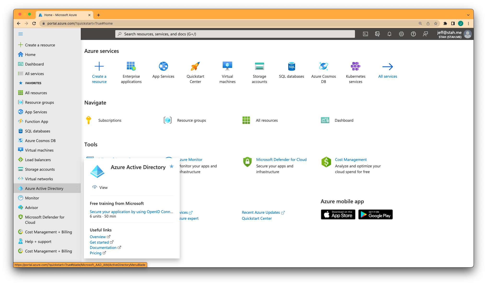
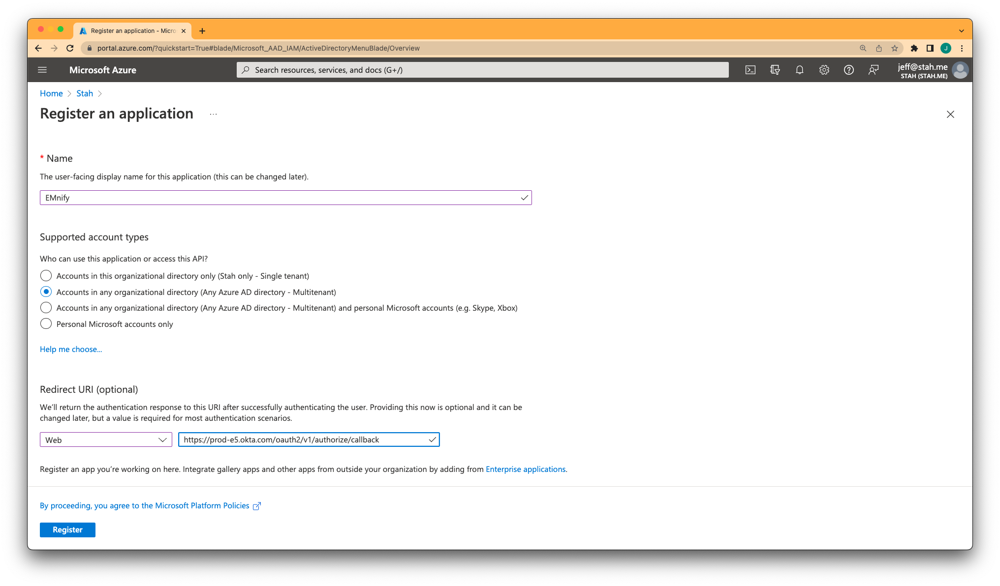
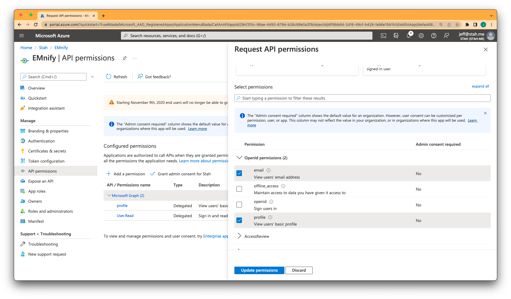
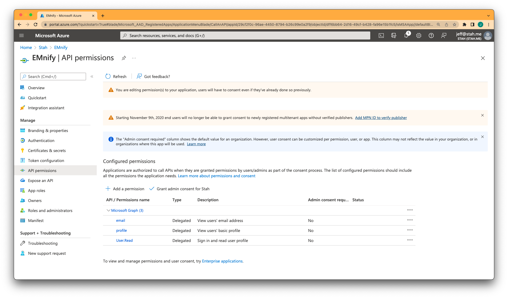
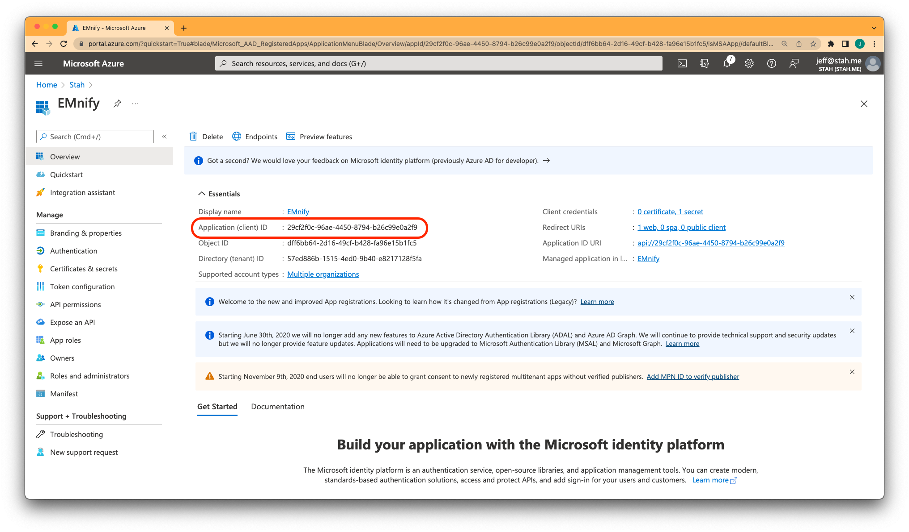
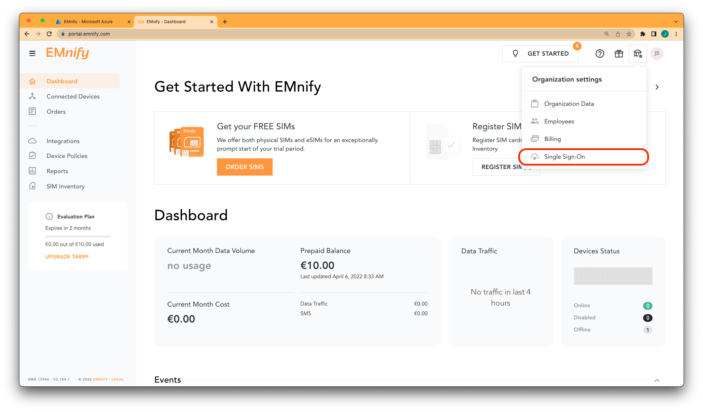
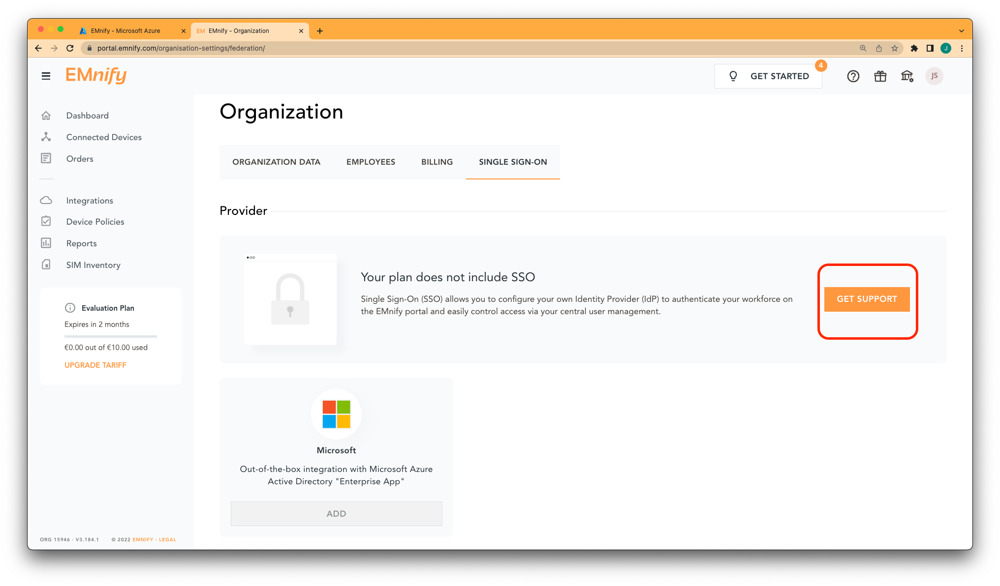
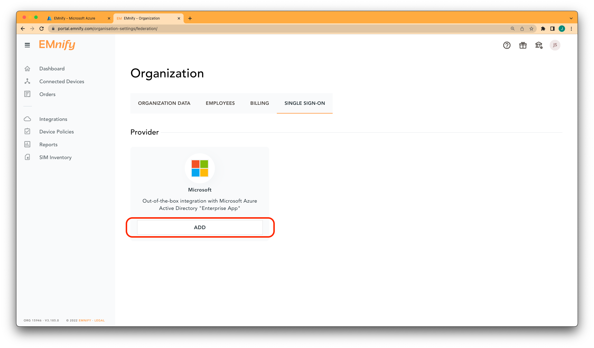
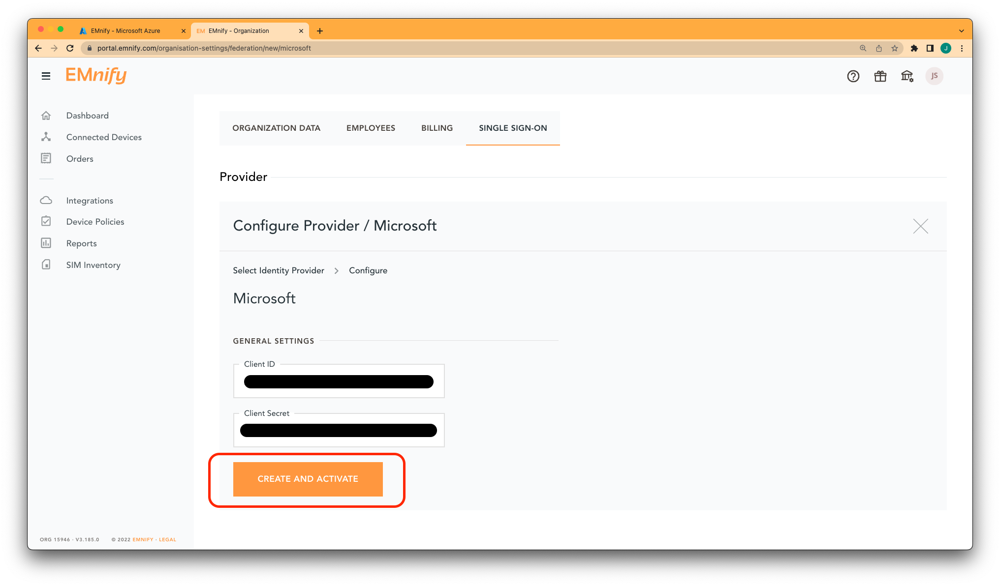
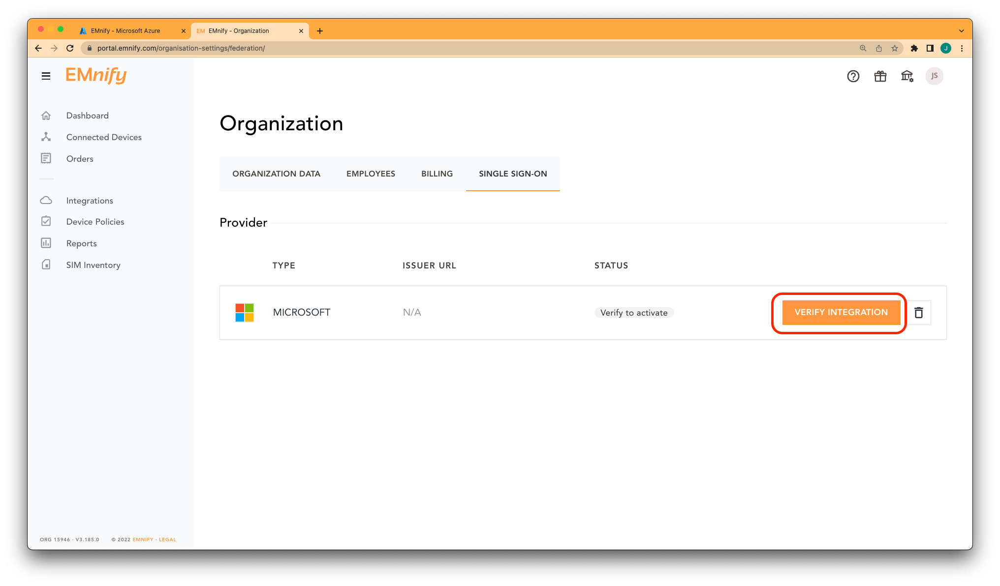

# Single Sign-On

With Single Sign-On (SSO) enabled, members of your organization with access to the EMnify portal will be able to log in using their Microsoft Business account credentials.

### Setup SSO with Microsoft Active Directory

**Prerequisites:**

- An Azure Subscription with an Active Directory license
- An account in the EMnify portal using the same email address as the one used to sign in to Microsoft Azure

:::caution
If your email address used in the EMnify portal is not the same as the one used to login to Azure, this setup will not work.
Instead, add an additional user to the EMnify portal with `Administrator` privileges.
:::

#### SSO with Microsoft

Log into Azure and navigate to Azure Active Directoring in the left sidebar.

At the top of the page, click on `+ Add` and then `App Registration`.

- Give it a **name** (i.e. `EMnify`)
- The **Supported Account Types** should be **Multi Tenant**.
This will request for a consent screen on IDP verification in the portal later.
    
- Set the Redirect URI to type `Web` with the value: `[https://prod-e5.okta.com/oauth2/v1/authorize/callback](https://prod-e5.okta.com/oauth2/v1/authorize/callback)`

    

Navigate to **Authentication** in the left sidebar, and in the section **Implicit grand and hybrid flows** enable `Access Tokens` and `ID Tokens`.

Go to **Token configuration** in the left sidebar, click on **Add optional claim** and under **SAML** enable to `upn` claim.
Leave the option **Turn on the Microsoft Graph profile** permission unchecked.

Head to **API permissions** in the left sidebar, click on the existing permission entry **Microsoft Graph (1)** and check the `email` and `profile` OpenID permissions.

Your configuration should look like this:

In the left sidebar, go to **Expose an API** and click on `Set` and then click on `save`.

After navigating to **Certificates & Secrets** in the left sidebar, click on `New client secret`.

Copy the **Value** and save it to a secure location.
This value will not be shown again in the portal.
Choose an expiration date and mark our calendar to generate and configure a new secret right before it expires.

Navigate to **Overview** in the sidebar and copy the `Application (client) ID` field for later use in the EMnify portal.

#### Configure the EMnify Portal

Login to your EMnify account, go to organization settings in the topbar, and click on **Single Sign-On**.

If you do not already have SSO enabled for your account, contact support and request that it be enabled.

Otherwise, click on **Add** under the Microsoft SSO provider.

Fill in the ``Application (client) ID and the `Secret Value`` that you copied earlier, then click **Create and Activate**.

The final step is to verify the provider.
SSO will not be configured until you complete this step.
Click on **Verify Integration** and follow the prompts.

#### Troubleshooting

In the unlikely event that the provider could not be configured on the very first attempt, check the following:

- If the user receives a "User cancelled social login", check if the application registration is set to Multi-tenant.
- Is the user part of the Azure Tenant?
- Is the user part of the EMnify enterprise?
- Is the user enabled?
- Try again using incognito tab.
