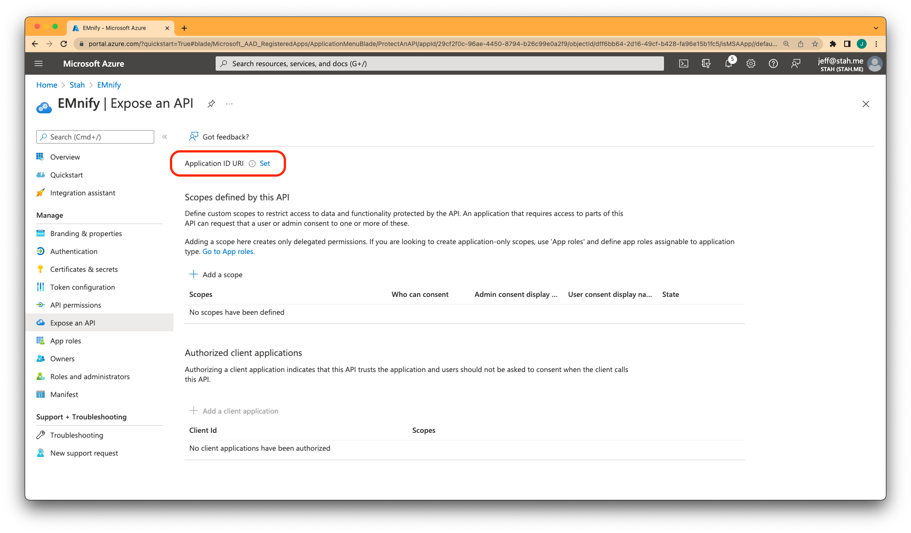

# Setup SSO with Microsoft Active Directory

This guide walks through enabling single sign-on (SSO), so your organization can access the [emnify Portal](https://portal.emnify.com/) using your Microsoft Business credentials.

**Prerequisites:**

- An Azure Subscription with an Active Directory license
- An account in the emnify Portal using the same email address as the one used to sign in to Microsoft Azure

:::caution
If your email address used in the emnify Portal differs from the one used to log in to Azure, this setup won't work.
Instead, add an additional user to the emnify Portal with **Administrator** privileges.
:::

## SSO with Microsoft

Log in to Azure and navigate to **Azure Active Directoring** in the left sidebar.

At the top of the page, click **+ Add** and then **App Registration**. 
From there:

- Give your app a **Name** (e.g., "emnify").
- The **Supported Account Types** should be `Multitenant`.
This requests a consent screen on IDP verification in the Portal later. 
- Set the Redirect URI to type `Web` with the value: `https://prod-e5.okta.com/oauth2/v1/authorize/callback`

Navigate to **Authentication** in the left sidebar, and in the section **Implicit grand and hybrid flows**, enable `Access tokens` and `ID tokens`.

Go to **Token configuration** in the left sidebar, click **Add optional claim**, and under **SAML**, enable the `upn` claim.
Leave the option `Turn on the Microsoft Graph profile` permission unchecked.

Head to **API permissions** in the left sidebar, click the existing permission entry **Microsoft Graph (1)** and check the `email` and `profile` OpenID permissions.

Your configuration should look like this:

In the left sidebar, go to **Expose an API**, click **Set**, and then click on **Save**.

After navigating to **Certificates & Secrets** in the left sidebar, click **New client secret**.

Copy the **Value** and save it to a secure location.

:::danger
This value won't be shown again.
:::

Choose an expiration date and mark your calendar to generate and configure a new secret before it expires.

Navigate to **Overview** in the sidebar and copy the **Application (client) ID** to use later in the emnify Portal.

## Configure the emnify Portal

Log in to your emnify account, go to Organization Settings (building icon) in the top-level navigation, and click **Single Sign-On**.

import OrgSso from './assets/portal-organization-settings-sso.png';

If you need SSO enabled for your account, contact support by selecting **Upgrade**.

Otherwise, click **Add** under the Microsoft SSO provider.

Fill in the **Client ID** and **Client Secret** with the values you copied earlier, then click **Create and Activate**.

The final step is to verify the provider. 
Click on **Verify Integration** and follow the prompts.

:::caution
You must complete the final step and verify the provider to configure SSO.
:::

:::tip
We have a [Troubleshooting page](troubleshooting#microsoft-active-directory) if you encounter issues while setting up SSO.
:::